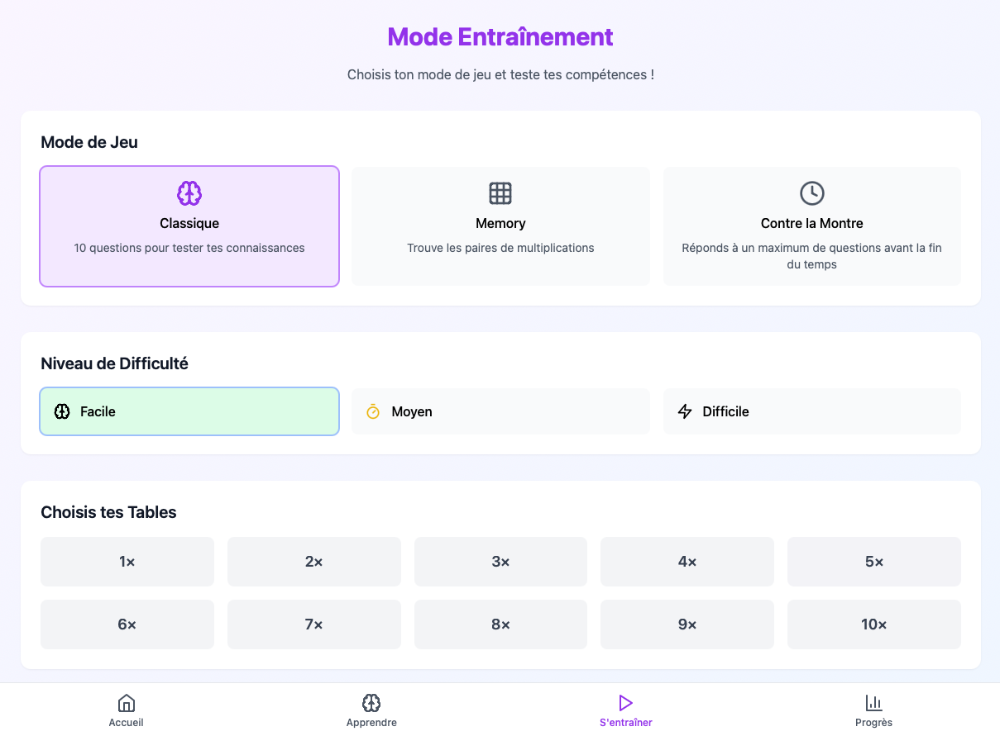

# MultiMaster - Application d'Apprentissage des Tables de Multiplication

MultiMaster est une application web interactive et ludique conçue pour aider les enfants à maîtriser leurs tables de multiplication à travers différents modes de jeu et un système de progression motivant.



## ✨ Fonctionnalités

### 📚 Apprentissage Adaptatif
- Système intelligent de détection des points faibles
- Suggestions personnalisées basées sur les performances
- Répétition optimisée des multiplications difficiles
- Astuces et conseils contextuels

### 🎮 Modes de Jeu
- **Mode Classique**: Quiz de 10 questions avec système d'étoiles
- **Memory**: Trouvez les paires de multiplications correspondantes
- **Contre la Montre**: Répondez à un maximum de questions avant la fin du temps
- Différents niveaux de difficulté (Facile, Moyen, Difficile)

### 🏆 Système de Progression
- Niveaux et points d'expérience (XP)
- Système d'étoiles consécutives
- Défis quotidiens
- Classement des joueurs
- Badges et récompenses

## 🧠 Système de Suivi des Difficultés

MultiMaster utilise un système sophistiqué de suivi des difficultés (Difficulty Tracker) pour optimiser l'apprentissage :

### Fonctionnement

1. **Détection des Points Faibles**
   - Analyse continue des performances sur chaque multiplication
   - Calcul du taux de réussite et suivi des succès consécutifs
   - Identification des multiplications nécessitant plus de pratique

2. **Adaptation Dynamique**
   - 70% des questions générées ciblent les points faibles
   - Probabilité de sélection basée sur le taux d'échec
   - Plus une multiplication est difficile, plus elle apparaît fréquemment

3. **Critères de Maîtrise**
   - Minimum de 3 tentatives requises
   - Taux de réussite supérieur à 85%
   - 3 succès consécutifs nécessaires
   - Une fois maîtrisée, la multiplication sort de la rotation des points faibles

4. **Persistance des Données**
   - Sauvegarde automatique des statistiques
   - Synchronisation entre les appareils
   - Mode hors-ligne disponible

## 🛠 Technologies Utilisées

- React 18 avec TypeScript
- Tailwind CSS pour le style
- Firebase (Auth & Firestore)
- Framer Motion pour les animations
- Canvas Confetti pour les célébrations
- Vite comme bundler

## 📋 Prérequis

- Node.js 18+
- Compte Firebase (gratuit)

## 🚀 Installation

1. Clonez le dépôt :
```bash
git clone https://github.com/votre-username/multimaster.git
cd multimaster
```

2. Installez les dépendances :
```bash
npm install
```

3. Configurez Firebase :
   - Créez un fichier `.env` à la racine :
```env
VITE_FIREBASE_API_KEY=votre-api-key
VITE_FIREBASE_AUTH_DOMAIN=votre-auth-domain
VITE_FIREBASE_PROJECT_ID=votre-project-id
VITE_FIREBASE_STORAGE_BUCKET=votre-storage-bucket
VITE_FIREBASE_MESSAGING_SENDER_ID=votre-messaging-sender-id
VITE_FIREBASE_APP_ID=votre-app-id
```

4. Lancez le serveur de développement :
```bash
npm run dev
```

## 🤝 Contribution

Les contributions sont les bienvenues ! Consultez notre guide de contribution pour commencer.

## 📄 Licence

Ce projet est sous licence MIT. Voir le fichier `LICENSE` pour plus de détails.